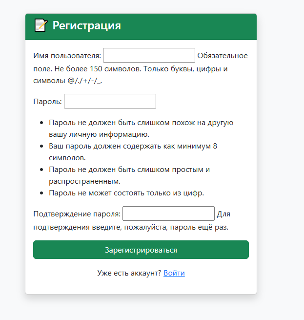
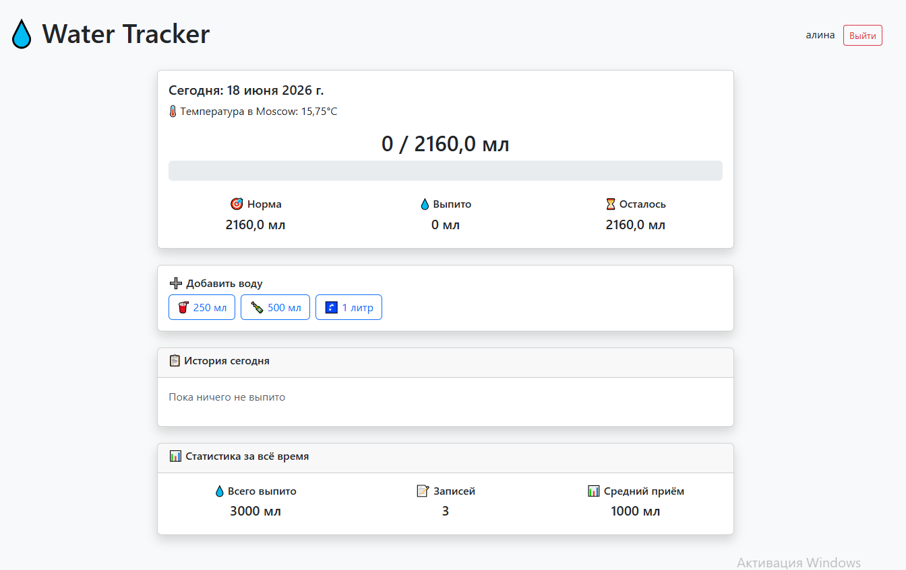
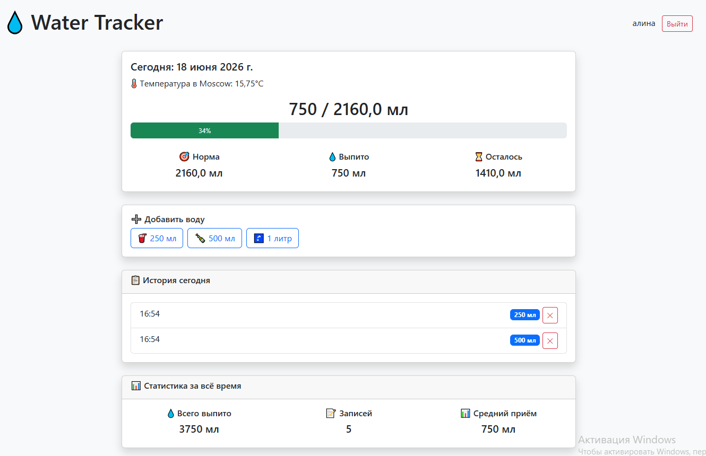

# 💧 Water Tracker

Сервис для отслеживания потребления воды с автоматической коррекцией дневной нормы на основе погоды. Помогает поддерживать водный баланс с учётом веса, возраста, физической активности и температуры воздуха.

## Технологии
* **Python 3.14**
* **Django 6.0.6**
* **OpenWeatherMap API**
* **Bootstrap 5**

## Скриншоты

*Страница регистрации нового пользователя*


*Страница входа пользователя*


*Главная страница с трекером воды и прогрессом*


*Кнопки добавления и удаления*

## Как запустить проект локально
1. **Клонируйте репозиторий:**
   ```bash
   git clone 
   ```
2. **Создайте и активируйте виртуальное окружение:**
   ```bash
   python -m venv venv
   source venv/bin/activate  # для Linux/Mac
   venv\Scripts\activate     # для Windows
   ```
3. **Установите зависимости:**
   ```bash
   pip install -r requirements.txt
   ```
4. **Выполните миграции:**
   ```bash
   python manage.py migrate
   ```
5. **Запустите сервер:**
   ```bash
   python manage.py runserver
   ```
6. **Откройте проект в браузере:**
   Перейдите по ссылке: http://127.0.0.1:8000/